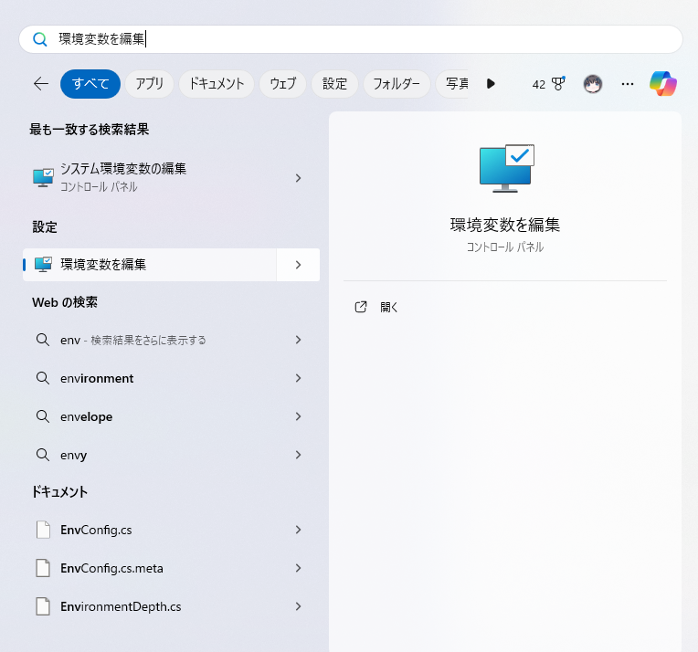
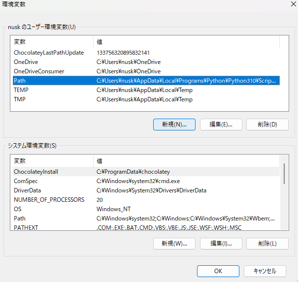
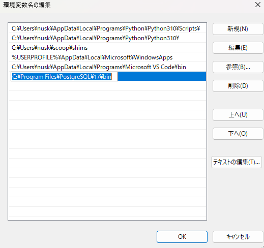

# Sakiyama Group Experiment

## Install Docker

### Windows

1. Download Docker Desktop
https://www.docker.com/get-started/

2. Install Docker Desktop and Restart Your PC

3. Download PostgreSQL
https://www.enterprisedb.com/downloads/postgres-postgresql-downloads

4. Install PostgreSQL

5. Open Edit Environment


6. Add PostgreSQL Path to PATH
```
C:\Program Files\PostgreSQL\17\bin
```




Reference
[Qiita Reference](https://qiita.com/zembutsu/items/a98f6f25ef47c04893b3)
[]()

### Ubuntu

Add Docker repository

```sh
# Add Docker's official GPG key:
sudo apt update
sudo apt install ca-certificates curl
sudo install -m 0755 -d /etc/apt/keyrings
sudo curl -fsSL https://download.docker.com/linux/ubuntu/gpg -o /etc/apt/keyrings/docker.asc
sudo chmod a+r /etc/apt/keyrings/docker.asc

# Add the repository to Apt sources:
echo \
  "deb [arch=$(dpkg --print-architecture) signed-by=/etc/apt/keyrings/docker.asc] https://download.docker.com/linux/ubuntu \
  $(. /etc/os-release && echo "$VERSION_CODENAME") stable" | \
  sudo tee /etc/apt/sources.list.d/docker.list > /dev/null
sudo apt update
```

Setup Docker
```sh
    sudo groupadd docker
    sudo usermod -aG docker <user name>
```
Start Docker
```sh
sudo systemctl enable --now docker
```

Install Docker
```sh
sudo apt install docker-ce docker-ce-cli containerd.io docker-buildx-plugin docker-compose-plugin
```

### Red Hat

Add Docker Repository

```sh
sudo dnf -y install dnf-plugins-core
sudo dnf config-manager --add-repo https://download.docker.com/linux/rhel/docker-ce.repo
```

Install Docker
```sh
sudo dnf install docker-ce docker-ce-cli containerd.io docker-buildx-plugin docker-compose-plugin
```

Start Docker
```sh
sudo systemctl enable --now docker
```

### Arch Linux

Install Docker

```sh
sudo pacman -S docker docker-compose
```

Start and Enable Docker
```sh
sudo systemctl enable --now docker.service
```

## kadai3

### How to run

```sh
cd kadai3
docker compose up -d
```

### How to stop container

```sh
docker compose down
```

### In Sql

```sh
psql -h localhost -U user -d postgres
```

## kadai4

URL
http://localhost:8080/samples/pgsql/sqltest.php

### How to run

```sh
cd kadai4
docker compose up -d --build
```

### In Sql

```sh
psql -h localhost -U apache -d www
```